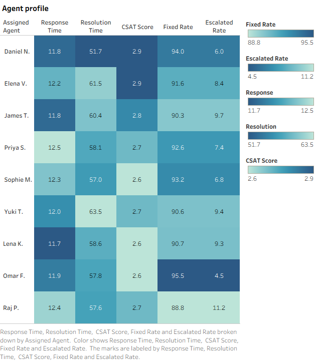
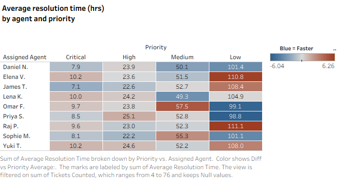
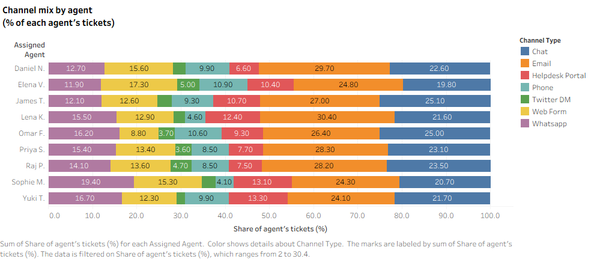
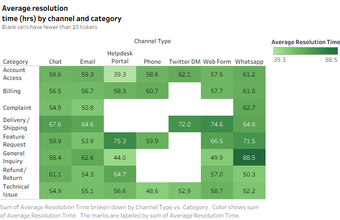
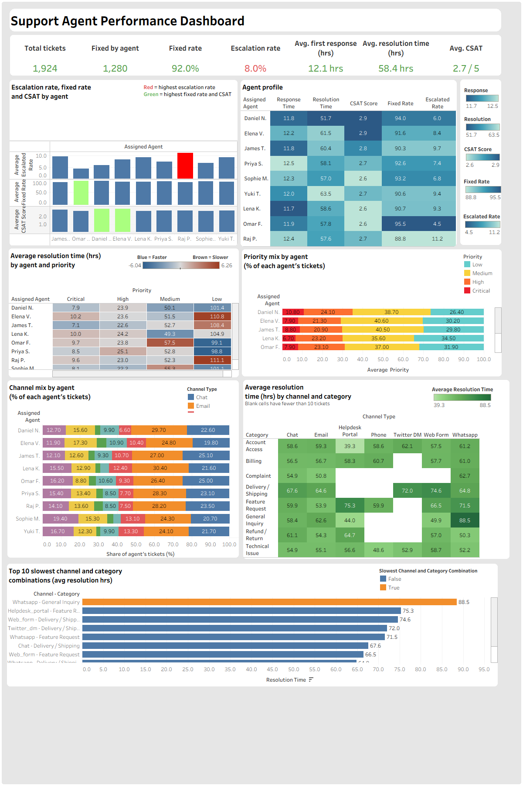

# Support Agent Performance Analysis — MySQL and Tableau

**One-line summary:** Ranking support agents by overall resolution time is misleading: in this simulated dataset, ticket priority mix accounts for most of the gap between the fastest and slowest agent (†), while channel mix accounts for almost none (†).

<sub>† Rough checks calculated outside MySQL with a quick script. Treat them as indicative, not as statistical tests.</sub>

---

## 1. Business Problem

*Practice scenario (the source dataset does not state a business problem).*

A customer support team at a multi-product SaaS company handles tickets across several channels, categories, and priority levels. Managers want to know how individual agents perform, but each ticket type is different, so a simple comparison can be unfair or misleading.

**Questions this project answers**
1. Which agents fix tickets themselves, and which escalate them to engineering?
2. How do agents compare on first response time, resolution time, and CSAT?
3. Do differences between agents reflect real performance, or just the kinds of tickets they receive (priority, channel, category)?

---

## 2. Dataset

| Item | Detail |
|---|---|
| Source | [TODO: dataset name and link] |
| Description | Simulated customer support system for a multi-product SaaS company: 7 channels, tickets from creation to resolution |
| File | `Customer_Support_Datasets.csv` |
| Size after cleaning | 1,924 rows × 23 columns, one row per ticket (the source describes 2,000) |
| Period | 2024-01-01 to 2025-06-30 |
| MySQL table | `tickets_raw_staging` |

**Key columns:** `ticket_id`, `created_at`, `resolved_at`, `channel`, `category`, `priority`, `status`, `sentiment`, `product`, `assigned_agent`, `agent_id`, `first_response_time_hrs`, `resolution_time_hrs`, `csat_score`, `escalated`, `reopened`

**Data notes**
- `resolution_time_hrs` is blank for the 532 tickets that are still `Open` or `In Progress`.
- `csat_score` is blank for all `Escalated` tickets and for open tickets (644 in total).
- `escalated` is stored as text (`'True'` / `'False'`) in MySQL.
- 9 agents, with roughly 194 to 247 tickets each.

**Differences from the source description**
- The source describes 2,000 tickets; the loaded and cleaned tables have 1,924 (76 ticket IDs are absent from the source file itself).
- The source describes 5 sentiment levels; the file has 4 (Very Negative, Negative, Neutral, Positive).
- The source mentions 6 languages but lists 7; the file has 7.

---

## 3. Tools Used

- MySQL 8.0 and MySQL Workbench (queries, CTEs, window functions)
- Tableau (Custom SQL data sources, calculated fields, dashboard)
- AI assistance (Claude) for explanations, query review, and documentation drafting
- Excel (used to import the dataset to MySQL Workbench)

**Setup notes**
1. Load the cleaned CSV into a MySQL table named `tickets_raw_staging` (database `customer_support`).
2. In Tableau, connect to MySQL (`localhost`, port `3306`) and add each query as its own Custom SQL data source, without the final `ORDER BY` and semicolon.
3. MySQL 8 logs in with `caching_sha2_password`. After a MySQL restart, Tableau may fail with "Authentication requires secure connection". Log in once through MySQL Workbench first, or tick *Require SSL* and choose `ca.pem` as the SSL CA file.

---

## 4. Data Cleaning

| | Rows |
|---|---|
| Source dataset (as described) | 2,000 |
| Original table `tickets_raw` (as loaded) | 1,924 |
| After cleaning (`tickets_raw_staging`) | **1,924** |

The cleaning script removed no rows. 76 ticket IDs (3.8% of the 2,000 described) are missing from the source file itself: `TKT-00021`, for example, is not in the original downloaded file.

**What was wrong**
- Blank text instead of NULL in numeric and date columns
- Dates stored as text
- Extra spaces in text columns
- Blank `agent_id` values
- A free-text `message` column that the analysis does not use

**How I fixed it** (working on a staging copy of the table)

```sql
CREATE TABLE tickets_raw_staging LIKE tickets_raw;
INSERT INTO tickets_raw_staging SELECT * FROM tickets_raw;

-- blanks to NULL, then convert dates
UPDATE tickets_raw_staging SET created_at  = NULL WHERE created_at  = '';
UPDATE tickets_raw_staging SET resolved_at = NULL WHERE resolved_at = '';
UPDATE tickets_raw_staging
   SET created_at  = STR_TO_DATE(created_at,  '%Y-%m-%d %H:%i:%s'),
       resolved_at = STR_TO_DATE(resolved_at, '%Y-%m-%d %H:%i:%s');
ALTER TABLE tickets_raw_staging MODIFY COLUMN created_at  DATETIME;
ALTER TABLE tickets_raw_staging MODIFY COLUMN resolved_at DATETIME;

-- trim spaces (shown for two columns; the script covers all text columns)
UPDATE tickets_raw_staging SET channel = TRIM(channel), category = TRIM(category);

-- other blanks to NULL (shown for two columns; the script covers eight)
UPDATE tickets_raw_staging SET csat_score = NULL WHERE csat_score = '';
UPDATE tickets_raw_staging SET resolution_time_hrs = NULL WHERE resolution_time_hrs = '';

-- drop the unused column and fill blank agent IDs from the agent name
ALTER TABLE tickets_raw_staging DROP COLUMN message;
UPDATE tickets_raw_staging SET agent_id = REGEXP_SUBSTR(assigned_agent, '[0-9]+')
WHERE agent_id IS NULL OR agent_id = '';
```

**Validation:** the row count is the same before and after cleaning (1,924 in `tickets_raw` and in `tickets_raw_staging`). A duplicate check on `ticket_id` was run, and the cleaned data has 1,924 unique IDs. Blank values are now NULL, so `AVG()` and `COUNT(column)` skip them.

---

## 5. Analysis

Steps in the order I did them:

1. **Exploration:** average resolution time and CSAT by agent; resolution time by product and category.
2. **Fixed vs escalated:** per-agent counts and rates, with ranks. Rates use tickets that reached an outcome (fixed + escalated), so open tickets do not count against anyone.
3. **Agent scorecard:** counts, rates, ranks, and the three averages in one table.
4. **Fairness check by priority:** average resolution time by agent *within* each priority.
5. **Channel and category:** does channel or category explain slower resolution?
6. **Channel and priority mix by agent:** does each agent get a different mix of tickets?
7. **Dashboard:** KPI cards and charts in Tableau.


*Caption: Shows the averages of response time, resolution time, CSAT Score, Fixed rate, escalated rate of each nine agents*


*Caption: Shows the average resolution time per priority of each nine agents*


*Caption: Shows the percentage of shares of each agents in different channels*


*Caption: Shows the average resolution time of each categories in differen channel type*


*Caption: Shows the different charts and KPIs *


---

## 6. SQL Queries

### Agent scorecard

One row per agent. The fixed and escalation rates divide by the tickets that reached an outcome. `NULLIF` avoids division by zero, and the `ORDER BY` inside `RANK()` decides how ranks are assigned.

```sql
-- Agent scorecard: counts, rates, ranks and averages per agent
WITH agent_fixed_escalation AS
(
SELECT agent_id, assigned_agent,
    COUNT(CASE WHEN escalated = 'False'
               AND status IN ('Resolved','Closed') THEN 1 END)    AS total_fixed,
    COUNT(CASE WHEN escalated = 'False'
               AND status IN ('Open','In Progress') THEN 1 END)   AS total_still_open,
    COUNT(CASE WHEN escalated = 'True' THEN 1 END)                AS total_escalated,
    COUNT(*)                                                      AS total_agent_handled,
    AVG(first_response_time_hrs) AS avg_frh,
    AVG(resolution_time_hrs)     AS avg_rth,
    AVG(csat_score)              AS avg_csatscore
FROM tickets_raw_staging
GROUP BY agent_id, assigned_agent
)
SELECT agent_id, assigned_agent, total_fixed, total_still_open, total_escalated,
    total_agent_handled,
    ROUND(100.0 * total_fixed     / NULLIF(total_fixed + total_escalated, 0), 1) AS fixed_rate_pct,
    ROUND(100.0 * total_escalated / NULLIF(total_fixed + total_escalated, 0), 1) AS escalated_rate_pct,
    RANK() OVER (ORDER BY 1.0 * total_fixed
                 / NULLIF(total_fixed + total_escalated, 0) DESC)     AS agent_rank_in_fixed,
    RANK() OVER (ORDER BY 1.0 * total_escalated
                 / NULLIF(total_fixed + total_escalated, 0) DESC)     AS agent_rank_in_escalation,
    ROUND(avg_frh, 1)       AS avg_response_time,
    ROUND(avg_rth, 1)       AS avg_resolution_time,
    ROUND(avg_csatscore, 1) AS avg_csat_score
FROM agent_fixed_escalation
ORDER BY agent_id ASC;
```

### Average resolution time by agent and priority

Compares agents on the same kind of ticket. Counting the same column as the `AVG` shows how many tickets each average rests on.

```sql
-- Fairness check: average resolution time per agent within each priority
SELECT agent_id,
       assigned_agent,
       priority,
       COUNT(resolution_time_hrs)         AS tickets_counted,
       ROUND(AVG(resolution_time_hrs), 1) AS avg_resolution_time
FROM tickets_raw_staging
GROUP BY agent_id, assigned_agent, priority
ORDER BY FIELD(priority, 'Critical', 'High', 'Medium', 'Low'),  -- custom priority order
         avg_resolution_time ASC,                                -- fastest agent first
         agent_id;                                               -- tie-breaker
```

### Priority mix by agent (two CTEs and a JOIN)

The same pattern with `channel` in place of `priority` gives each agent's channel mix.

```sql
-- Share of each agent's tickets in each priority level
WITH first_cte AS
(
SELECT agent_id, assigned_agent, priority, COUNT(*) AS priority_count_per_agent
FROM tickets_raw_staging
GROUP BY agent_id, assigned_agent, priority
),
second_cte AS
(
SELECT agent_id, COUNT(*) AS total_agent_tickets
FROM tickets_raw_staging
GROUP BY agent_id
)
SELECT f.agent_id, f.assigned_agent, f.priority, f.priority_count_per_agent,
       s.total_agent_tickets,
       ROUND(100.0 * f.priority_count_per_agent / s.total_agent_tickets, 1) AS priority_pct
FROM first_cte AS f
JOIN second_cte AS s ON f.agent_id = s.agent_id
ORDER BY f.agent_id, FIELD(f.priority, 'Critical', 'High', 'Medium', 'Low');
```

### Resolution time by channel and category

`HAVING` hides groups with fewer than 10 tickets, because tiny groups give unreliable averages.

```sql
-- Which channel and category combinations are slowest?
SELECT channel,
       category,
       COUNT(resolution_time_hrs)         AS tickets_counted,
       ROUND(AVG(resolution_time_hrs), 1) AS avg_resolution_time
FROM tickets_raw_staging
GROUP BY channel, category
HAVING tickets_counted >= 10
ORDER BY avg_resolution_time DESC;
```

---

## 7. Dashboard


**Tableau Public link:** [https://public.tableau.com/views/SupportAgentPerformanceDashboard/SupportAgentPerformanceDashboard?:language=en-US&publish=yes&:sid=&:redirect=auth&:display_count=n&:origin=viz_share_link)]

| Row | What is there |
|---|---|
| KPI cards | Total tickets, Fixed by agent, Fixed rate, Escalation rate, Avg. first response, Avg. resolution time, Avg. CSAT |
| Agents | Escalation rate, fixed rate and CSAT by agent (highlighted), next to the Agent profile table |
| Priority | Average resolution time by agent and priority (heatmap), next to Priority mix by agent |
| Channel and category | Channel mix by agent, next to the channel and category heatmap |
| Top 10 | The ten slowest channel and category combinations |

**KPI values (cleaned data):** 1,924 tickets · 1,280 fixed by agent · 92.0% fixed rate · 8.0% escalation rate · 12.1 hrs average first response · 58.4 hrs average resolution time · 2.7 / 5 average CSAT

Colors: red marks the highest escalation rate (the watch-list number). On the priority heatmap, blue means faster than the average for that priority and brown means slower. Blank cells in the channel and category heatmap have fewer than 10 tickets.

---

## 8. Key Insights

- **Fixed and escalation rates differ modestly.** Fixed rates run from 88.8% to 95.5% and escalation rates from 4.5% to 11.2%. The highest escalation rate is Agent_006 (Raj P) at 11.2%, 17 escalations out of 152 tickets with an outcome.
- **The metrics don't line up.** Agent_004 (Omar F) has the best fixed rate (95.5%) but is mid-table on speed and tied for the lowest average CSAT (2.6). Across 1,280 rated tickets, CSAT has almost no relationship with first response time or resolution time (†).
- **Priority changes the picture.** Critical tickets average roughly 7 to 10 hours per agent and Low tickets roughly 99 to 111 hours. Agent_008 (Daniel N) has the fastest overall average (51.7 hrs) but ranks 2nd, 6th, 2nd and 4th within the four priority levels, helped by a high share of Critical tickets (10.8%) and a low share of Low ones (26.4%).
- **Channel mix explains very little.** Every agent gets about 24% to 30% of tickets by email and 20% to 25% by chat. In a rough what-if check (†), priority mix accounts for about 8.8 hours of the 11.8-hour spread between agents, against about 0.5 hours for channel mix and 0.9 for category mix.
- **Slowest combinations.** whatsapp / General Inquiry (88.5 hrs, 10 tickets), helpdesk_portal / Feature Request (75.3 hrs, 13 tickets) and web_form / Delivery / Shipping (74.6 hrs, 16 tickets) are slowest. Delivery / Shipping and Feature Request appear repeatedly near the top.

### Limitations
- The dataset is **simulated**, so agent results describe this data, not real people.
- Many groups are small (for example 4 to 17 Critical tickets per agent, and 7 to 17 escalations per agent), so averages and ranks can shift with a few tickets.
- CSAT is blank for escalated tickets, and it is unclear what resolution time means for them.
- The what-if check (†) is a rough estimate, not a statistical test.
- 76 ticket IDs are missing from the source file (2,000 described, 1,924 present).

---

## 9. Business Recommendations

1. **Compare agents within a priority level,** not on overall resolution-time averages.
2. **Judge agents on a profile, not a single rank:** fixed rate, speed, and CSAT together.
3. **Use the escalation rate as a prompt to review tickets,** not as a verdict, because the groups are small.
4. **Fix the data capture:** record CSAT for escalated tickets and define what resolution time means for them.
5. **Every agents should have fair distibution of tickets.


---

## Repository structure (suggested)

```
├── README.md
├── sql/      # numbered .sql files: cleaning, scorecard, fairness checks, mix, KPI check
├── images/   # dashboard.png, scorecard.png, priority_heatmap.png, channel_mix.png
├── docs/     # Final_Project_Documentation.pdf, Dashboard_Guide.pdf, KPI_Guide.pdf
└── data/     # optional: only if the dataset's license allows sharing
```

---

**Author:** Aaron Briones · [LinkedIn](http://www.linkedin.com/in/aaron-briones) 
